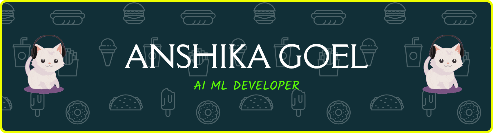

  

<h1 align="center">Hi 👋, I'm Anshika Goel</h1>
<h3 align="center">💻 AI Enthusiast | DSA Practitioner | Aspiring Software Engineer</h3>

---

---

## 🚀 About Me

- 🎓 B.Tech CSE (AI) student at **KIET (Graduation: 2027)**
- 📊 SGPA: **8.0**
- 💻 Solved **220+ DSA problems (LeetCode)**
- 🤖 Passionate about **Machine Learning & Computer Vision**
- 🌐 Exploring **Full Stack Development**
- 🧠 Strong interest in **System Design & Scalable Systems**

---

## 🛠 Tech Stack

### 👨‍💻 Programming Languages

---

### 🤖 ML & AI

---

### 🌐 Web Development

---

### 🧰 Tools

---

## 📈 GitHub Streak

---

## 🧠 Problem Solving Profiles

---

## 🚀 Current Focus

- 📚 Advanced **DSA & Problem Solving**
- 🤖 **Machine Learning & AI**
- 🌐 **Full Stack Development**
- 🎯 Preparing for **Product-Based Companies**

---

## 📫 Connect With Me

---

⭐ *“Keep building, keep learning, keep growing.”*